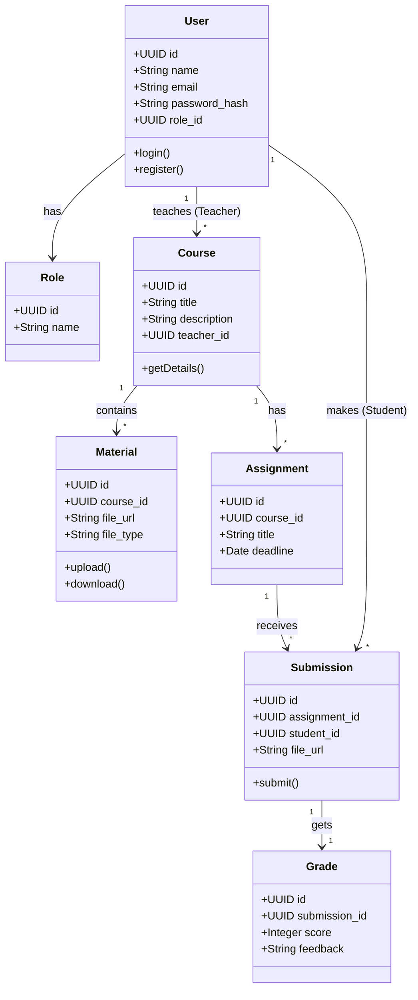
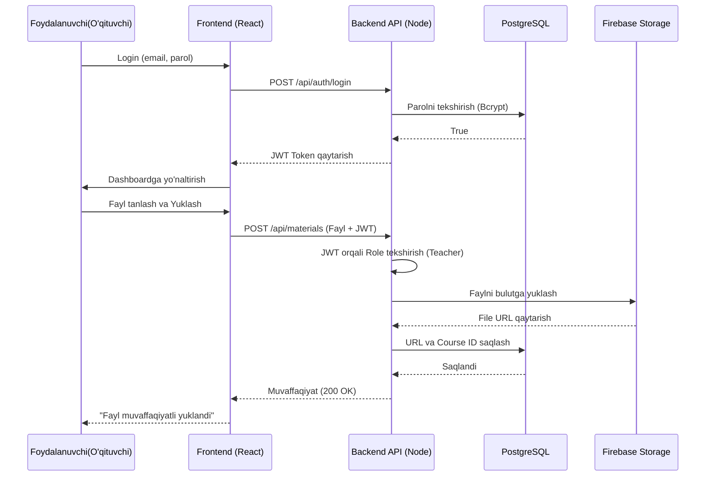

# EduCloud Secure - UML Diagrammalar

Bu faylda loyihaning asosiy UML diagrammalari Mermaid.js formatida keltirilgan. Markdown viewer orqali ko'rishingiz mumkin.

## 1. Use Case Diagram (Foydalanish holatlari)

```mermaid
usecaseDiagram
    actor "Talaba" as Student
    actor "O'qituvchi" as Teacher
    actor "Admin" as Admin

    package "EduCloud Secure System" {
        usecase "Tizimga kirish/Ro'yxatdan o'tish" as UC_Login
        usecase "Kurslarni ko'rish" as UC_ViewCourses
        usecase "Materiallarni yuklab olish" as UC_Download
        usecase "Topshiriq yuborish" as UC_Submit
        usecase "Baho ko'rish" as UC_ViewGrade

        usecase "Kurs yaratish" as UC_CreateCourse
        usecase "Material yuklash (Firebase)" as UC_UploadMaterial
        usecase "Topshiriq yaratish" as UC_CreateTask
        usecase "Topshiriqlarni baholash" as UC_Grade

        usecase "Foydalanuvchilarni boshqarish" as UC_ManageUsers
        usecase "Rollarni o'zgartirish" as UC_ManageRoles
        usecase "Audit loglarni ko'rish" as UC_Audit
    }

    Student --> UC_Login
    Student --> UC_ViewCourses
    Student --> UC_Download
    Student --> UC_Submit
    Student --> UC_ViewGrade

    Teacher --> UC_Login
    Teacher --> UC_CreateCourse
    Teacher --> UC_UploadMaterial
    Teacher --> UC_CreateTask
    Teacher --> UC_Grade

    Admin --> UC_Login
    Admin --> UC_ManageUsers
    Admin --> UC_ManageRoles
    Admin --> UC_Audit
```

## 2. Class Diagram (Sinflar diagrammasi)



## 3. Sequence Diagram (Ketma-ketlik diagrammasi - Autentifikatsiya va Yuklash)



## 4. Deployment Diagram (Joylashtirish diagrammasi)

```mermaid
graph TD
    UserClient[Foydalanuvchi Brauzeri] -->|HTTPS / REST API| Vercel[Frontend - Vercel Hosting\n(React.js + Tailwind)]
    Vercel -->|API Requests (JWT)| Render[Backend Server - Render\n(Node.js + Express)]
    Render -->|SQL Queries| Postgres[(PostgreSQL Database\nRender DB or Supabase)]
    Render -->|File Stream| FirebaseCloud[Firebase Cloud Storage\n(Google Cloud)]
    UserClient -.->|Fayllarni to'g'ridan to'g'ri ko'rish| FirebaseCloud
```
